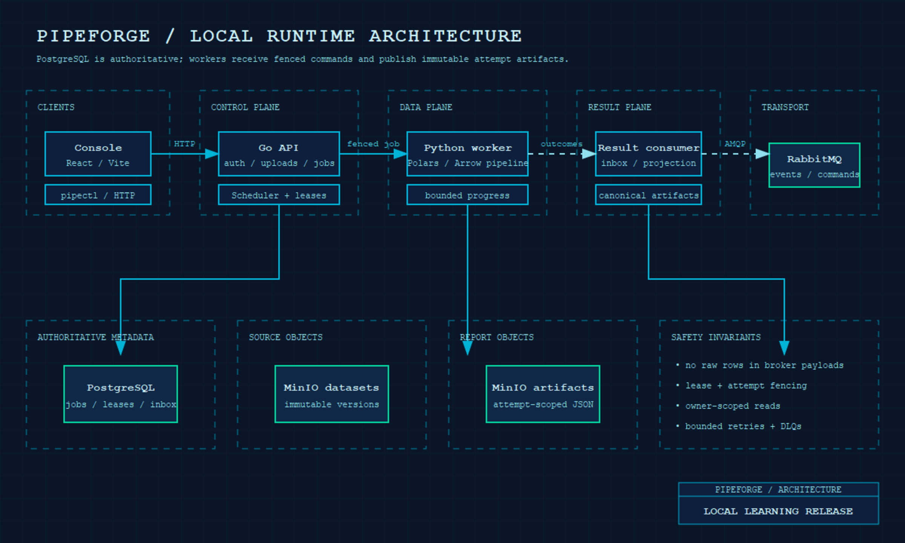
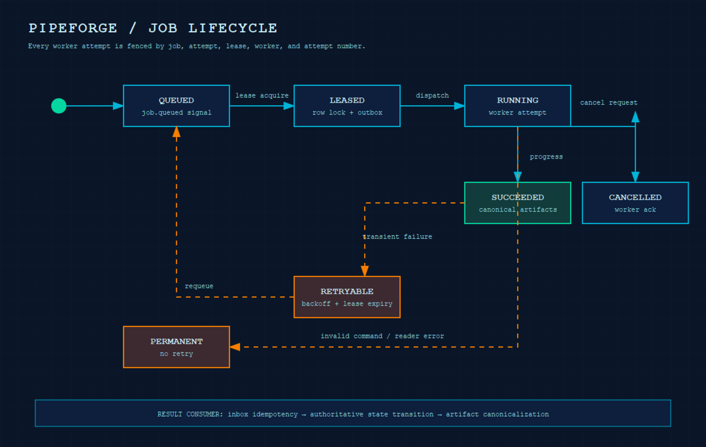

# PipeForge

PipeForge is a production-oriented distributed data-processing platform for uploading datasets, scheduling analysis jobs, processing data with Python workers, and accepting results through a reliable Go control plane.

> Status: The local runtime path is verified end to end: upload → capability-aware multi-worker scheduling → lease-bound dispatch → Python processing → canonical artifacts → authorized download. This is a serious learning repository with production-oriented boundaries, not a production deployment. Cloud HA remains intentionally out of scope.

## Architecture

The system is intentionally split into two planes:

- Go control plane: API, identity, PostgreSQL metadata, job state transitions, scheduler, leases, outbox/inbox processing, result consumption, audit, and administration.
- Python data plane: format readers, bounded chunk processing, profiling, data-quality checks, anomaly detection, artifact generation, and worker messaging.
- PostgreSQL is the authoritative metadata store. Python workers never mutate core job-state tables.
- RabbitMQ carries versioned asynchronous commands/events. MinIO stores immutable raw dataset versions and attempt-scoped artifacts.

See [the system overview](docs/architecture/system-overview.md), [control-plane boundary](docs/architecture/control-plane.md), and [data-plane boundary](docs/architecture/data-plane.md).

Identity endpoints and credential handling are documented in [the API contract](docs/api/openapi.yaml) and [the identity security notes](docs/security/identity.md).

## Repository layout

```text
go/             Go API, scheduler, result consumer, pipectl CLI, migrations
python/         Typed Python worker and processing modules
contracts/      Versioned JSON Schema envelopes, examples, changelog
infrastructure/ Docker, RabbitMQ, MinIO, Prometheus, Grafana
docs/           Architecture, ADRs, security, testing, and runbooks
scripts/        Cross-platform development and validation helpers
frontend/       Small API-backed operator console (no storage credentials)
plans/          Persistent implementation plan and phase reports
```

## Local prerequisites

The local environment requires:

- Docker Engine with Compose v2
- Go 1.25 (the module and build image are pinned to the Go 1.25 toolchain line)
- Python 3.12+ with a virtual environment
- GNU Make or the documented PowerShell equivalents

No cloud account or production credential is required for local development. `.env.example` contains development-only local defaults. Copy it to `.env` locally when needed and never commit `.env`.

## Current local environment

Start PostgreSQL, RabbitMQ, MinIO, the Go control plane, scheduler, result consumer, and Python worker with:

```text
copy .env.example .env
make bootstrap
```

Optional monitoring services:

```text
docker compose --profile monitoring up -d prometheus grafana
```

Default host ports are isolated from common local stacks: API `58080`, PostgreSQL `55433`, RabbitMQ `55672`/management `55673`, MinIO `59010`/console `59011`, Prometheus `59090`, and Grafana `53010`. Change them in `.env` if needed.

Compose runs the idempotent migration before runtime services. Start the stack with:

```text
make dev
```

Run the disposable real-service smoke test from another terminal:

```powershell
make e2e
```

It creates a throwaway account and dataset, uploads a CSV, runs profile/missing-value/outlier operations, waits for `SUCCEEDED`, verifies three canonical artifacts, and downloads one artifact. It prints IDs and status only; it does not print tokens, presigned URLs, or dataset rows.

To start the optional second worker and prove real distribution across two
worker identities:

```powershell
make multi-worker-e2e
```

The multi-worker proof runs four complete jobs concurrently, confirms both
worker identities receive successful attempts, verifies exact UUID-suffixed
job/cancellation bindings, confirms legacy queues have no consumers, and
finishes a real leased job as `CANCELLED`. The scheduler admits only workers
with a fresh heartbeat, compatible operation capabilities, and an available
authoritative lease slot. Commands and active cancellations are routed to
UUID-suffixed worker queues. Legacy shared-queue
compatibility is disabled by default. During a bounded upgrade cutover, the
operator must enable it on no more than one designated worker; this deployment
rule is intentionally not coordinated by the worker process itself.

The verified identity endpoints are available under `/v1`: registration, login, refresh, logout, and owner-scoped API-key management. Dataset registration, owner-scoped listing/detail/deletion, streamed CSV/JSONL/Parquet version uploads, and presigned multipart sessions are also available. Multipart clients initiate a session, upload each server-scoped part URL, register its ETag/size, then complete with an ordered part list; Go verifies the assembled object before promoting the immutable version. Expired sessions are cleaned in bounded batches with `make cleanup`; in-flight completion receives the configured `PIPEFORGE_MULTIPART_COMPLETION_GRACE` window, and transient object-store errors remain retryable. The API returns a refresh token only at authentication/rotation time; API-key plaintext and MinIO credentials are never returned.

You can inspect the plan and validate the worktree at any time:

```powershell
git status --short
Get-Content plans/20260801-1300-pipeforge-platform/plan.md
```

The repository CI mirrors the local quality gates: Go format/test/race/vet,
real PostgreSQL/RabbitMQ integration tests, Python lint/format/type/test,
contract and documentation validation, Compose configuration, console unit
coverage and desktop/mobile browser accessibility tests, a production console
build, and a full multi-worker Compose E2E flow. The complete validation
evidence and known limits are recorded in [the release package](docs/release/README.md).

## Published containers

The `0.2.3-local` release publishes role-specific, non-root images for
`linux/amd64` and `linux/arm64` to both GHCR and Docker Hub. For example:

```text
docker pull ghcr.io/jasontm17/pipeforge-api:0.2.3-local
docker pull nguyenson1710/pipeforge-worker:0.2.3-local
```

Available image suffixes are `api`, `scheduler`, `result-consumer`, `migrate`,
and `worker`. Production automation should pin the immutable digest recorded by
the release workflow instead of relying on a mutable version tag. See the
[container publication guide](docs/operations/container-publication.md) for
the complete matrix, verification commands, and release policy.





The real local demonstration is captured as a compact [E2E flow GIF](docs/assets/videos/local-e2e-flow.gif).

## Operator console

The optional console is a thin, API-backed learning surface. It stores an access token only in browser session storage, never receives MinIO credentials, and renders live owner-scoped datasets, jobs, progress, and artifacts. It cancels superseded requests, clears expired sessions, preserves selected jobs in the URL, and exposes loading/error/empty states to assistive technology. Run it from `frontend/`:

```text
npm ci
npm test
npm run test:browser
npm run dev
```

The companion `pipectl` exercises the same public API without touching
PostgreSQL, RabbitMQ, or MinIO directly:

```powershell
go run ./go/cmd/pipectl login --email you@example.test --password "your-local-password"
go run ./go/cmd/pipectl datasets
go run ./go/cmd/pipectl jobs
```

The token is stored in the ignored `.pipeforge-token` file, or supplied through
`PIPEFORGE_TOKEN`/`PIPEFORGE_TOKEN_FILE`.

## Repository security

CI, CodeQL, dependency automation, secret scanning, and protected-branch
policy are documented in
[repository security gates](./docs/security/repository-gates.md).
The [threat model](./docs/security/threat-model.md) and
[secure configuration guide](./docs/security/secure-configuration.md) map the
implemented controls and remaining deployment risks.

## Engineering rules

- Use explicit Conventional Commits, grouped by one logical behavior.
- Stage intended paths; do not use blind `git add .`.
- Run formatting, static analysis, tests, contract validation, and secret scanning before commits.
- Keep message consumers idempotent and use bounded retries/DLQs; never create infinite requeue loops.
- Treat upload data as untrusted. Do not log passwords, API keys, presigned URLs, object secrets, or full dataset rows.
- Record architecture decisions in `docs/adr/` and update docs when public behavior or architecture changes.

## Implementation plan

The full A-to-Z plan is [here](plans/20260801-1300-pipeforge-platform/plan.md), with one phase file per delivery boundary. The attached project specification is distilled into [docs/implementation-plan.md](docs/implementation-plan.md).

## License

PipeForge is licensed under the [Apache License 2.0](LICENSE). It permits use,
modification, and distribution, including commercial use, subject to the
license terms and preservation requirements.
