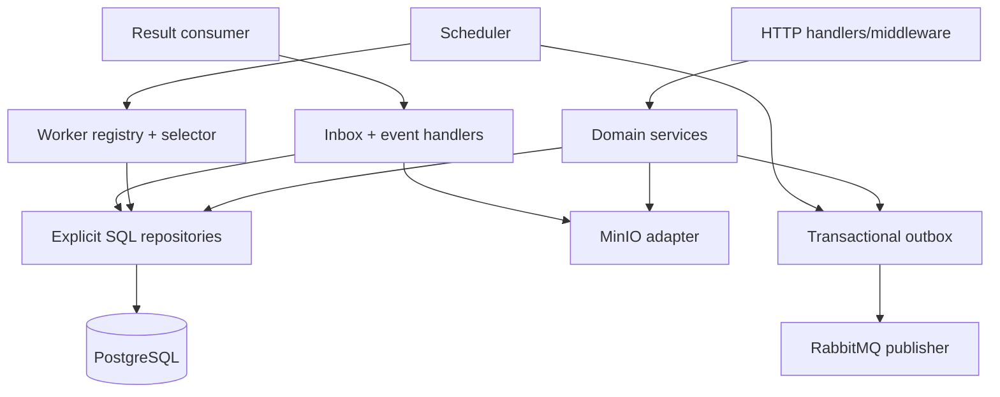

# Control-plane boundary

The Go control plane is the authority for identity, metadata, job lifecycle, and operational decisions. It is intentionally split into API, scheduler, and result-consumer processes so each long-running loop can be scaled and restarted independently.

## Components

## Invariants

- State transitions are explicit, validated against the current state, and recorded in history.
- The API never publishes a job command directly from inside the database transaction. It commits an outbox row; a separate publisher confirms delivery.
- Result consumers insert the message ID into an inbox table and apply the state/artifact transition in the same transaction. A duplicate message is a no-op.
- Result consumers expose only canonical artifacts. Staged objects remain attempt-scoped until a matching successful result promotes their object keys.
- A result is accepted only when its job, attempt, lease, and worker identity match the current authoritative records.
- Resource ownership and scope checks occur in domain services, not only in HTTP handlers.
- Dataset version uploads stream through the Go service into MinIO; PostgreSQL records a version only after object size, checksum, and existence are verified.
- Multipart sessions and registered parts are authoritative in PostgreSQL. Presigned URLs contain only a server-generated object key and opaque upload scope; completion verifies ordered parts, object size, checksum, and detected format before making the version available.
- Expiry cleanup claims at most the configured batch limit. Missing objects are aborted and their staged versions are failed; valid final objects are reconciled into the staged version instead of being deleted. Fresh completion attempts receive a configurable grace window, transient storage/database errors remain retryable, and re-running the command is safe.
- Job creation validates the owner and available dataset version, canonicalizes operation requests for idempotency, and commits job, attempt, history, quota, and a job-only `processing.job.queued` outbox signal atomically. Cancellation and retry are explicit intent commands; the fair scheduler selects bounded owner-rotated candidates without assigning leases before the lease phase.
- Worker registration and heartbeat events are stored separately from result events. Lease acquisition locks an eligible worker and attempt in one transaction; stale, incapable, draining, offline, or full workers receive no new work.
- Internal errors and diagnostic references stay server-side; public problem responses expose stable codes and request IDs.
- Expired leases are swept with row locks. Retry scheduling updates the attempt, job, quota, history, and delayed outbox command atomically; exhausted retries become inspectable dead-letter records and can be replayed through an owner/admin authorization boundary.

## Runtime processes

- `go/cmd/api`: synchronous HTTP request handling and lightweight dependency checks.
- `go/cmd/scheduler`: long-running outbox dispatch, fair job selection,
  capability-aware worker assignment, worker-event consumption, lease expiry,
  retry scheduling, and bounded maintenance loops.
- `go/cmd/result-consumer`: RabbitMQ result/event consumer with manual acknowledgements.
- `go/cmd/pipectl`: public API client; never connects to data stores directly.
