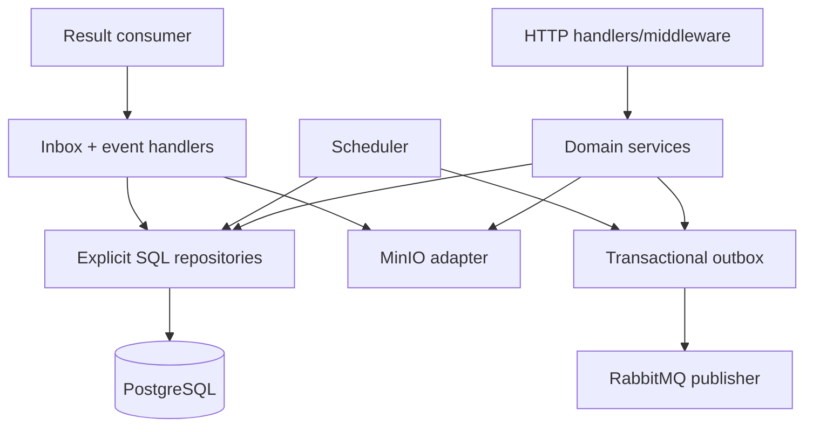

# Control-plane boundary

The Go control plane is the authority for identity, metadata, job lifecycle, and operational decisions. It is intentionally split into API, scheduler, and result-consumer processes so each long-running loop can be scaled and restarted independently.

## Components

## Invariants

- State transitions are explicit, validated against the current state, and recorded in history.
- The API never publishes a job command directly from inside the database transaction. It commits an outbox row; a separate publisher confirms delivery.
- Result consumers insert the message ID into an inbox table and apply the state/artifact transition in the same transaction. A duplicate message is a no-op.
- A result is accepted only when its job, attempt, lease, and worker identity match the current authoritative records.
- Resource ownership and scope checks occur in domain services, not only in HTTP handlers.
- Internal errors and diagnostic references stay server-side; public problem responses expose stable codes and request IDs.

## Runtime processes

- `go/cmd/api`: synchronous HTTP request handling and lightweight dependency checks.
- `go/cmd/scheduler`: outbox dispatch, fair job selection, lease expiry, retry scheduling, and upload cleanup loops.
- `go/cmd/result-consumer`: RabbitMQ result/event consumer with manual acknowledgements.
- `go/cmd/pipectl`: public API client; never connects to data stores directly.

