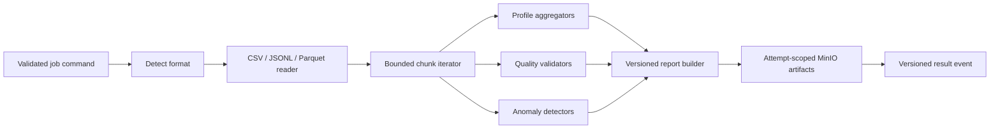

# Data-plane boundary

The Python data plane performs computation only. A worker receives a validated command, downloads the referenced immutable dataset object, processes bounded chunks, writes attempt-scoped artifacts, and publishes an event. It does not become the source of truth for job state.

## Processing pipeline

## Design rules

- Reader, processor, validator, detector, storage, and publisher interfaces are dependency-injected and testable with fakes.
- Polars is the initial dataframe engine because it supports columnar execution and bounded streaming patterns; the adapter boundary leaves room for another engine without changing contracts.
- Bad-row policies are explicit: fail fast, skip/report, or quarantine. Quarantine references are bounded and never log complete sensitive rows.
- Progress is throttled by time or percentage change. One message per row is prohibited.
- Cancellation is checked between chunks/stages. A worker stops safely, cleans temporary artifacts, and publishes a cancellation outcome.
- Generated artifacts use `reports/{jobId}/attempt-{attemptNumber}/...`-style keys. The worker never overwrites a canonical successful artifact.

## Failure behavior

Format/configuration/missing-column failures are non-retryable. Temporary broker/storage/network/resource failures are retryable within the Go-owned bounded policy. Lease renewal failure stops the worker from publishing an authoritative success for stale work; late events are ignored by the Go result consumer.

