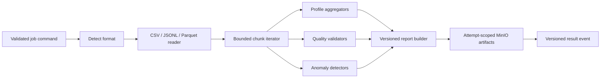

# Data-plane boundary

The Python data plane performs computation only. A worker receives a validated command, downloads the referenced immutable dataset object, processes bounded chunks, writes attempt-scoped artifacts, and publishes an event. It does not become the source of truth for job state.

## Phase 9 worker foundation

The package lives under `python/src/pipeforge_worker` and keeps external clients behind injected protocols. `Settings` validates bounded concurrency, prefetch, message size, heartbeat, and shutdown limits. The worker exposes `/health/live`, `/health/ready`, and `/metrics` on port `8090`; `PIPEFORGE_WORKER_HEALTH_ONLY=true` starts this surface without broker or object-storage intake.

The RabbitMQ adapter uses durable queues, persistent messages, publisher confirms, bounded prefetch, and manual acknowledgement. A command is acknowledged only after its handler returns `ACK`; malformed or not-yet-supported commands are rejected with `requeue=false`, which hands them to the configured dead-letter exchange. The intake classifier remains fail-closed until lease-bound source resolution and result publication are connected in the later result/lease phases.

Worker registration and heartbeat messages are validated against the shared JSON Schemas. Heartbeats expose only bounded worker metadata and at most 128 opaque job IDs. Structured logs redact credentials, bearer tokens, and presigned URL credentials; raw dataset rows are never logged.

## Processing pipeline

Phase 10 adds a format-aware reader factory and an injected `ProcessingPipeline`.
CSV and JSON Lines are decoded incrementally into bounded Polars frames; Parquet
uses PyArrow record batches and converts each batch to a Polars frame. Format
signals from magic bytes, content type, extension, and bounded sniffing must
agree, otherwise the input is rejected as ambiguous. Byte/row/chunk limits are
validated before iteration.

Malformed text rows use one of three explicit policies: `FAIL_FAST` raises a
non-retryable reader error, `SKIP_AND_REPORT` emits capped row-number/hash
diagnostics, and `QUARANTINE` emits the same bounded references with a
quarantine classification. Complete row contents are never logged.

The pipeline invokes injected aggregators between cancellation checks and emits
time-throttled progress snapshots. It does not decide authoritative job state,
promote artifacts, or publish success events; those responsibilities remain in
the Go result/lease workflow.

## Design rules

- Reader, processor, validator, detector, storage, and publisher interfaces are dependency-injected and testable with fakes.
- Polars is the initial dataframe engine because it supports columnar execution and bounded streaming patterns; the adapter boundary leaves room for another engine without changing contracts.
- Bad-row policies are explicit: fail fast, skip/report, or quarantine. Quarantine references are bounded and never log complete sensitive rows.
- Progress is throttled by time or percentage change. One message per row is prohibited.
- Cancellation is checked between chunks/stages. A worker stops safely, cleans temporary artifacts, and publishes a cancellation outcome.
- Generated artifacts use `reports/{jobId}/attempt-{attemptNumber}/...`-style keys. The worker never overwrites a canonical successful artifact.

## Failure behavior

Format/configuration/missing-column failures are non-retryable. Temporary broker/storage/network/resource failures are retryable within the Go-owned bounded policy. Lease renewal failure stops the worker from publishing an authoritative success for stale work; late events are ignored by the Go result consumer.
