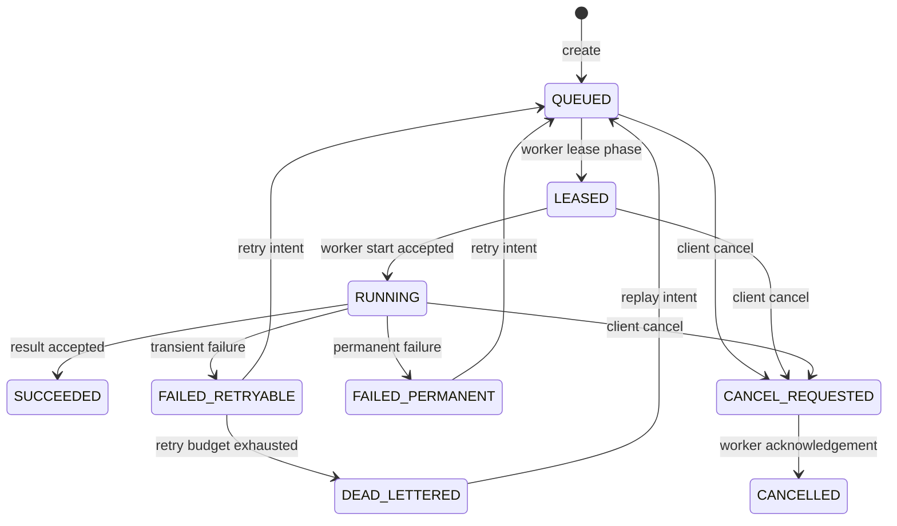
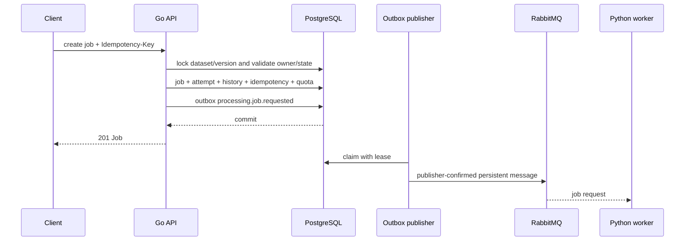

# Job management

The Go control plane owns processing jobs. A request is authorized against the dataset owner and an `AVAILABLE` dataset version before PostgreSQL creates the job, first attempt, transition history, idempotency record, quota counter, and `processing.job.requested` outbox row in one transaction.

## Public lifecycle

There is no arbitrary status-update endpoint. Every transition is checked against the current state, recorded in `job_state_history`, and either committed with its outbox command or rolled back together with it. `SUCCEEDED` and `CANCELLED` are terminal for this phase; failed states can only be re-queued through the retry-intent command and a new attempt row.

## API contract

- `POST /api/v1/datasets/{datasetVersionID}/jobs` creates a queued job (`/v1` is retained as a compatibility alias). `Idempotency-Key` is optional, owner-scoped, and limited to 128 bytes.
- `GET /api/v1/jobs` returns an owner-filtered page; administrators can see all owners.
- `GET /api/v1/jobs/{jobID}` returns a safe job projection without object-storage credentials or internal stack traces.
- `POST /api/v1/jobs/{jobID}/cancel` requests cancellation and publishes `processing.job.cancel-requested` through the outbox.
- `POST /api/v1/jobs/{jobID}/retry` re-queues an eligible failed/dead-lettered job and publishes a fresh request command.

Operation types are allowlisted: `PROFILE_DATASET`, `CHECK_MISSING_VALUES`, `CHECK_DUPLICATES`, `VALIDATE_QUALITY`, and `DETECT_OUTLIERS`. Column identifiers are restricted to safe identifier syntax, operation count is capped at 32, and request bodies are capped at 64 KiB. Fingerprints use canonical JSON, so object-key ordering cannot bypass idempotency conflict detection. Outlier detection supports IQR, Z-score, and modified Z-score with explicit finite-number, null-policy, sample-size, and reference bounds.

## Transaction and delivery boundary

RabbitMQ is never contacted inside the job transaction. If outbox insertion fails, no job or quota mutation remains. If publishing is retried, the message ID and consumer idempotency rules prevent an at-least-once delivery from becoming an unbounded state mutation.

## Fair selection

The scheduler reads a bounded candidate window with `FOR UPDATE SKIP LOCKED`; it does not assign a worker lease in this phase. Candidates are grouped by owner and selected in round-robin passes. Priority and age order jobs within an owner, while the round-robin boundary prevents one owner with a large backlog from consuming the entire batch. Lease assignment, heartbeat renewal, and timeout recovery belong to the later lease phase.

The initial per-owner admission bound is 100 queued jobs. Cancellation decrements the queued counter transactionally; retry admission increments it again only if capacity remains.
