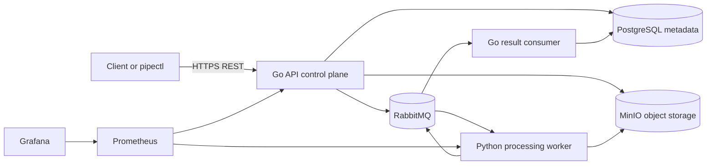

# System overview

PipeForge is a single repository containing independently runnable control-plane and data-plane processes. The first implementation targets a local Docker Compose environment, while preserving boundaries that can later be deployed separately.

## System context

## Container responsibilities

| Container/process | Owns | Must not own |
| --- | --- | --- |
| Go API | HTTP, identity, ownership, uploads, job commands, read models | Dataset processing, direct worker state mutation |
| Go scheduler | Fair admission, outbox-driven dispatch, lease expiry/retry | Parsing or report generation |
| Go result consumer | Event validation, inbox deduplication, authoritative transitions, artifacts | Trusting stale results, raw data transformation |
| Python worker | Read/stream/process data, quality/anomaly computation, artifacts, heartbeats | Core job-state SQL writes |
| PostgreSQL | Transactional metadata, state/history, leases, outbox/inbox, audit | Raw large objects |
| RabbitMQ | Durable asynchronous transport and DLQ routing | Business source of truth |
| MinIO | Raw immutable versions and artifacts | Authorization policy decisions |
| Prometheus/Grafana | Metrics collection and visualization | Request/job mutation |

## Trust boundaries

1. The client-to-API boundary treats all metadata, files, operation configs, and idempotency keys as untrusted.
2. The API-to-object-store boundary uses server-generated keys and bounded/validated streams.
3. The control-plane-to-broker boundary validates schemas, credentials, message size, and trace headers.
4. The broker-to-worker boundary treats commands as untrusted input and requires schema validation plus idempotent handling.
5. Worker result-to-control-plane is advisory until Go validates job, attempt, lease, ownership, and state.

## Core flow

1. Client creates or uploads an immutable dataset version.
2. Client submits an operation list with an idempotency key.
3. Go validates ownership/configuration, persists the job and outbox message atomically, and returns the job resource.
4. The outbox publisher sends a versioned command to RabbitMQ with publisher confirms.
5. A Python worker leases/executes the job, streams chunks from MinIO, writes attempt-scoped artifacts, and publishes a result event.
6. Go consumes the event, deduplicates it, validates lease/attempt, applies a state transition, and exposes accepted artifacts.

