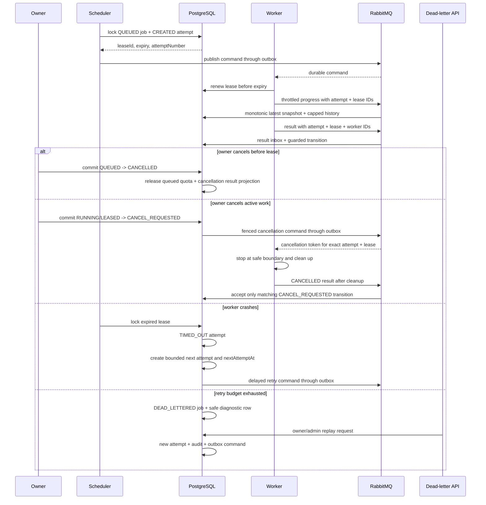

# Worker lease and failure recovery

Go owns the lease boundary. A worker can only renew the opaque lease assigned to its current attempt; result events carry the same attempt/lease/worker tuple and are rejected or ignored when it no longer matches PostgreSQL.

Cancellation and success are ordered by the committed PostgreSQL transition: a
success accepted first makes a later cancel invalid, while a committed
`CANCEL_REQUESTED` state makes a late success advisory and ignored. If an active
worker disappears after cancellation was requested, lease expiry finalizes the
same attempt as `CANCELLED` and releases its active quota slot.

## Timing trade-offs

- Lease duration is two minutes by default and is bounded at thirty minutes. A longer lease reduces duplicate recovery but delays detection after a crash.
- Renewal uses a two-minute extension by default. Workers should renew with enough margin for broker, network, and storage latency; a renewal after expiry is rejected.
- Result processing remains at-least-once. The inbox and lease tuple prevent a late result from overwriting a newer attempt.
- Retry delays are bounded (`0s`, `10s`, `30s`, `2m`, `10m`) with at most 20% positive jitter. The outbox `available_at` timestamp prevents a scheduled retry from being published early.
- After the per-job attempt limit, only safe error metadata, IDs, and an optional diagnostic reference are retained in `job_dead_letters`; raw rows and stack traces never enter the public API.
