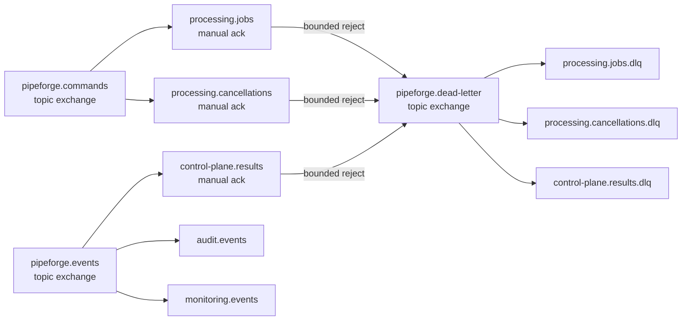

# RabbitMQ topology

RabbitMQ is used for durable at-least-once commands and events. The canonical declaration is [`infrastructure/rabbitmq/definitions.json`](../../infrastructure/rabbitmq/definitions.json); the Go queue package exposes the same topology for broker integration tests and controlled declarations.

## Delivery rules

- Exchanges and queues are durable and messages are persistent.
- Consumers use manual acknowledgements and acknowledge only after the PostgreSQL outcome or a durable retry/DLQ decision is committed.
- Publisher confirms are enabled. A lost confirmation may cause the same message ID to be published again; consumers must remain idempotent.
- A failed delivery is not requeued indefinitely. The outbox publisher schedules bounded retries with increasing delay and marks poison messages failed after the attempt budget is exhausted.
- Trace, correlation, causation, message ID, and schema version are copied into AMQP properties/headers.
- Queue payloads contain no credentials or raw dataset records.

The initial local topology uses the development credentials from `.env`; production deployments must provide separate least-privilege credentials and TLS-ready broker URLs.
